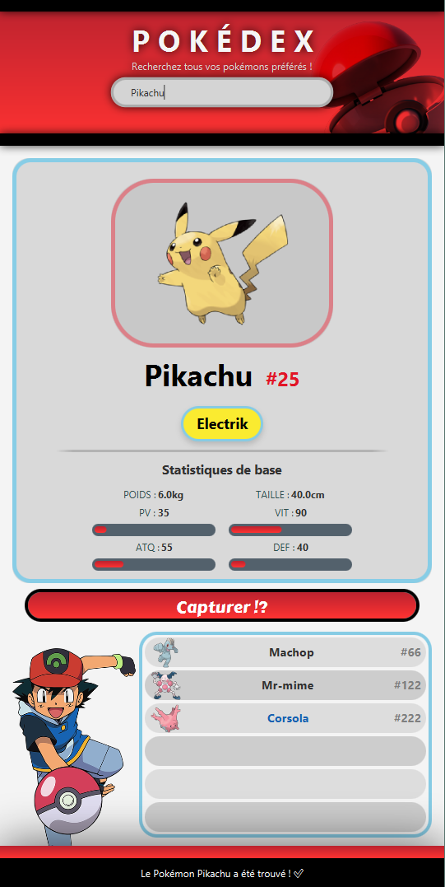
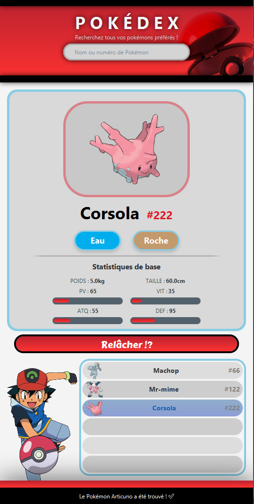

# Pokédex – Examen de mi-session (Algorithmes)

Application JavaFX permettant de consulter un Pokédex à partir d'une API externe et d'une base de données PostgreSQL locale.

## Description

Ce projet est une application développée en Java qui permet de parcourir un Pokédex interactif à partir des données de l'API https://pokeapi.co/ . Les données peuvent ensuite être capturées et stockées dans une base de données **PostgreSQL** et récupérées dynamiquement par l'application.

L'utilisateur peut rechercher rapidement un Pokémon et consulter ses informations dans une interface graphique moderne et intuitive.

---

# Aperçu de l'application

## Écran principal

>**

---

## Sélection à partir de la liste des Pokémon capturés

>**

---

## Relâche d'un Pokémon

>**

---

## Fonctionnalités

- Recherche de Pokémon par nom ou par ID
- Affichage des informations détaillées via la recherche
- Bouton pour capturer ou relâcher un Pokémon
- Popup de confirmation avant la relâche d'un Pokémon
- Liste interactive de Pokémon capturés
- Affichage des informations détaillées via la sélection d'un Pokémon de la liste des Pokémon capturés

---

# Bonus implémentés

- Focus automatique sur le champ de recherche au démarrage de l'application.

---

#  Installation

## Prérequis

- Éditeur de code comme IntelliJ IDEA
- Java JDK
- Maven
- PostgreSQL

---

## Étapes pour lancer le projet

### 1. Cloner le projet

```bash
git clone https://github.com/clementlaflamme/pokedex_exam_mi_session_algorithme.git
```

---
### 2. Recharger les projets Maven

Rechargez les projets Maven, accessible par le bouton de Maven dans le pom.xml ou dans la barre de droite dans IntelliJ.

---

### 3. Créer une nouvelle base de données PostgreSQL

Créez une base de données vide dans PostgreSQL.

---

### 4. Importer la base de données

Exécutez le fichier :

```
sqlDump.sql
```

dans votre nouvelle base de données PostgreSQL.

---

### 5. Modifier les informations de connexion

Ouvrez le fichier :

```
src/main/java/maisonneuve/com/util/Connexion.java
```

et modifiez les variables suivantes :

```java
URL
USER
PASS
```

afin qu'elles correspondent à votre configuration PostgreSQL.

---

### 6. Lancer l'application

Exécutez :

```
Main.java
```

---

#  Technologies utilisées

- Java
- JavaFX
- PostgreSQL
- JDBC
- Maven

---

#  Structure du projet

```
src/
 ├── controller/
 ├── modele/
 ├── util/
 ├── view/
 └── Main.java
```

---

#  Auteurs

Présenté par:
- Clément Laflamme
- Mathieu Gosselin

Développé dans le cadre de l'examen de mi-session du cours 420-930-MA ALGORITHMES ET MODÈLES DE PROGRAMMATION enseigné par Ahmed Imed Eddine Rabah. 